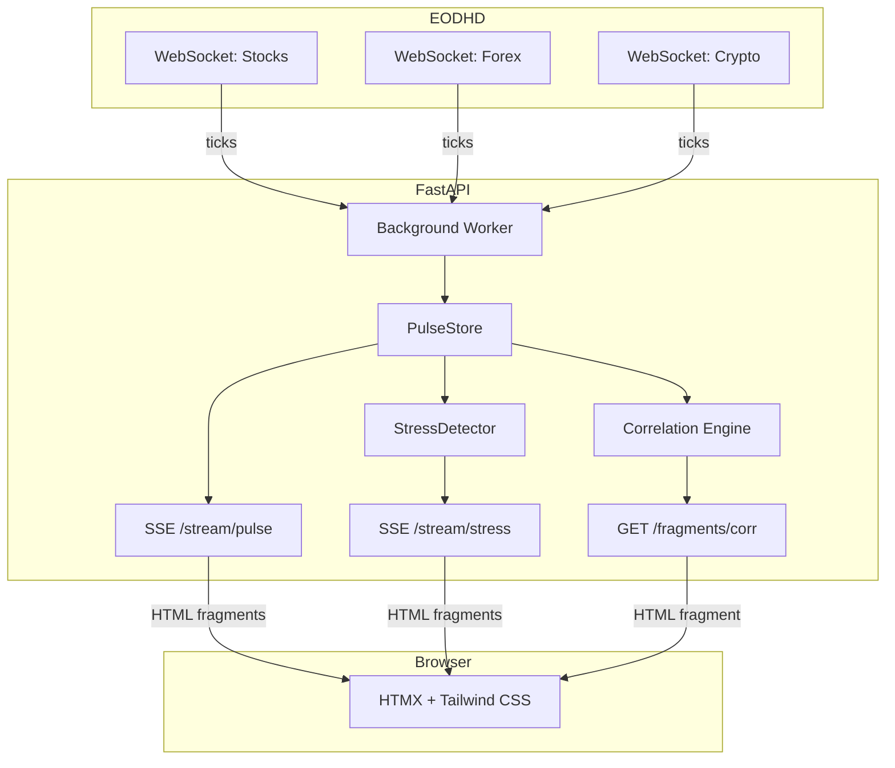
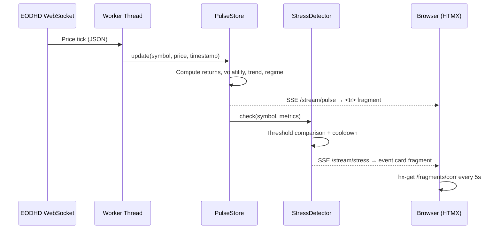

# ⚡ Pulse — Real-Time Market Dashboard

[](https://github.com/Moonchichiii/pulse/actions/workflows/ci.yml)
[](https://www.python.org/downloads/release/python-3120/)
[](LICENSE)
[](Dockerfile)

A real-time multi-asset market dashboard that streams live prices from EODHD
WebSocket feeds (stocks, forex, crypto), computes rolling metrics, detects
stress events with regime-aware thresholds, and surfaces everything through
a server-rendered UI.

**The thesis:** You don't need a JavaScript SPA framework to build a real-time
dashboard. The server owns all state and computation. The browser receives
ready-to-render HTML fragments over SSE.

## Architecture



## Data Flow



## Features

- **Multi-asset WebSocket ingestion** — stocks, forex, and crypto via EODHD
- **Rolling metrics** — 1 m / 5 m / 15 m returns, tick volatility, trend slope
- **Regime detection** — automatic normal / high-vol classification per symbol
- **Stress alerts** — asset-aware thresholds with regime multipliers and cooldown
- **Live correlation** — regime-adaptive Pearson ρ against a configurable base symbol
- **Server-Sent Events** — sub-second UI updates with zero client-side JS frameworks
- **HTMX + Alpine.js controls** — top-k filter, base symbol picker, bucket size selector
- **Dark-mode dashboard** — responsive layout, skeleton loading states, Tailwind CSS

## Tech Stack

| Layer | Tool | Why |
|-------|------|-----|
| Runtime | Python 3.12 | All financial logic lives here |
| Package manager | uv | Deterministic lockfile, sub-second installs |
| API framework | FastAPI | Async-native, WebSocket ingestion + SSE |
| Real-time UI | SSE via sse-starlette | Server pushes HTML fragments |
| Templating | Jinja2 | Server-side rendering of all UI |
| Client interactivity | HTMX (14 KB) | `hx-get`, `sse-swap`, zero JS build step |
| Optional client state | Alpine.js (15 KB) | Dropdowns/tabs only |
| Styling | Tailwind CSS | Utility-first, CDN for dev |
| Testing | pytest + pytest-asyncio + httpx | 176 tests, async test client |
| Linting | ruff + mypy (strict) | Type safety enforced in CI |
| CI/CD | GitHub Actions | lint → test → Docker build + smoke |
| Containerization | Docker + docker-compose | Single command to run |
| Data source | EODHD WebSocket feeds | Stocks, forex, crypto |
| Deployment | Render | Docker-native, auto-deploy from main |

## Metrics Computed

| Metric | Window | Method |
|--------|--------|--------|
| Return (1m, 5m, 15m) | Rolling | Log return from oldest tick in window |
| Volatility (15m) | Rolling | Tick-return standard deviation |
| Trend (15m) | Rolling | Log-price linear regression slope |
| Regime | Adaptive | `high_vol` if vol > 80th percentile of history |
| Correlation | Regime-aware | Pearson on time-bucketed aligned returns |

## Stress Events

| Event Type | Trigger | Cooldown |
|------------|---------|----------|
| `move_1m` | 1m return exceeds asset-class threshold | 30 s per (symbol, type) |
| `move_5m` | 5m return exceeds asset-class threshold | 30 s per (symbol, type) |
| `vol_spike` | Volatility exceeds regime threshold | 30 s per (symbol, type) |

Asset-class thresholds: crypto > stocks > forex (reflecting typical volatility).
In `high_vol` regime, thresholds are raised by 1.5× to suppress noise.

## Prerequisites

- [Python 3.12+](https://www.python.org/downloads/)
- [uv](https://docs.astral.sh/uv/) (package manager)
- [Docker](https://www.docker.com/) (optional, for container builds)
- An [EODHD API key](https://eodhd.com/) (for live data)

## Quick Start

### Local Development

```bash
git clone https://github.com/Moonchichiii/pulse.git
cd pulse
uv sync --dev
uv run pre-commit install
```

Create a `.env` file:

```text
EODHD_API_KEY=your_key_here
```

Run the app:

```bash
uv run uvicorn pulse.main:app --reload --port 8000
```

Open [http://localhost:8000](http://localhost:8000).

### Docker

```bash
cp .env.example .env   # add your EODHD_API_KEY
docker compose up --build
```

### Run Checks

```bash
uv run ruff check src/ tests/
uv run ruff format --check src/ tests/
uv run mypy src/
uv run pytest -v --tb=short
```

Or use the Makefile:

```bash
make lint
make test
```

## Configuration

All settings are read from environment variables or a `.env` file.

| Variable | Default | Description |
|---|---|---|
| `EODHD_API_KEY` | `""` | EODHD API key (required for live data) |
| `STOCK_SYMBOLS` | `AAPL,MSFT,GOOGL,AMZN,TSLA,NVDA,META,JPM,V,SPY` | Comma-separated stock tickers |
| `FOREX_SYMBOLS` | `EURUSD,EURSEK,USDSEK` | Comma-separated forex pairs |
| `CRYPTO_SYMBOLS` | `BTC-USD,ETH-USD,SOL-USD,XRP-USD,ADA-USD` | Comma-separated crypto pairs |
| `DEBUG` | `false` | Enable FastAPI debug mode |

## Deployment

### Render

The repo includes a [`render.yaml`](render.yaml) for one-click deploy.
Set `EODHD_API_KEY` as an environment variable in the Render dashboard.

### Self-hosted (Docker)

```bash
docker build -t pulse .
docker run -d -p 8000:8000 --env-file .env pulse
```

Health check: `GET /health` returns `{"status": "ok"}`.

## Project Structure

```text
src/pulse/
├── main.py           FastAPI app, lifespan, health endpoint
├── config.py         Pydantic settings (env vars)
├── models.py         Tick domain model, AssetClass enum
├── feeds.py          EODHD WebSocket consumers
├── store.py          PulseStore — rolling buffers + metrics
├── detector.py       StressDetector — threshold checks + cooldown
├── events.py         StressEvent, EventStore
├── correlation.py    Time-bucketed correlation engine
├── worker.py         Background thread orchestration
├── routes.py         Dashboard routes, SSE streams, HTMX fragments
└── templates/        Jinja2 templates (base, index, fragments)

tests/                176 tests — pytest + pytest-asyncio + httpx
docs/adr/             Architecture Decision Records
```

## Architecture Decision Records

- [ADR-001: Streaming Architecture](docs/adr/001-streaming-architecture.md) —
  SSE to browser, WebSocket for ingestion only
- [ADR-002: HTMX over SPA](docs/adr/002-htmx-over-spa.md) — Server-side
  rendering with Jinja2, no JS build step

## Roadmap

### v1.0 ✅ (current)

- [x] Multi-asset WebSocket ingestion (stocks, forex, crypto)
- [x] Rolling metrics: returns, volatility, trend, regime
- [x] Stress detection with asset-aware thresholds
- [x] Regime-aware correlation engine
- [x] Server-rendered dashboard with SSE + HTMX
- [x] Dark theme, responsive layout, Alpine.js controls
- [x] 176 tests, strict mypy, full CI/CD pipeline
- [x] Docker + Render deployment

### Future

- Persistent storage (TimescaleDB / ClickHouse)
- Historical replay mode
- Alerting integrations (Slack, email, webhooks)
- Per-symbol detail pages with sparkline charts
- Authentication and multi-tenant support

## Contributing

See [CONTRIBUTING.md](CONTRIBUTING.md) for setup instructions and workflow.

## License

[MIT](LICENSE)
