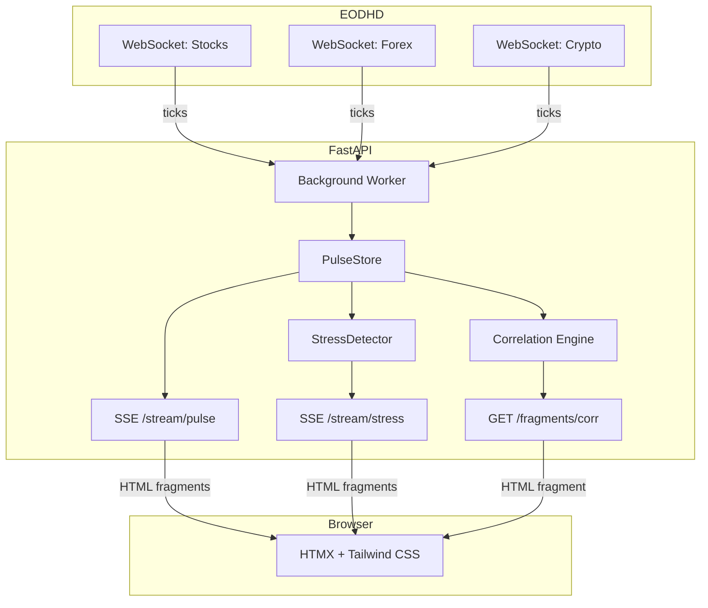
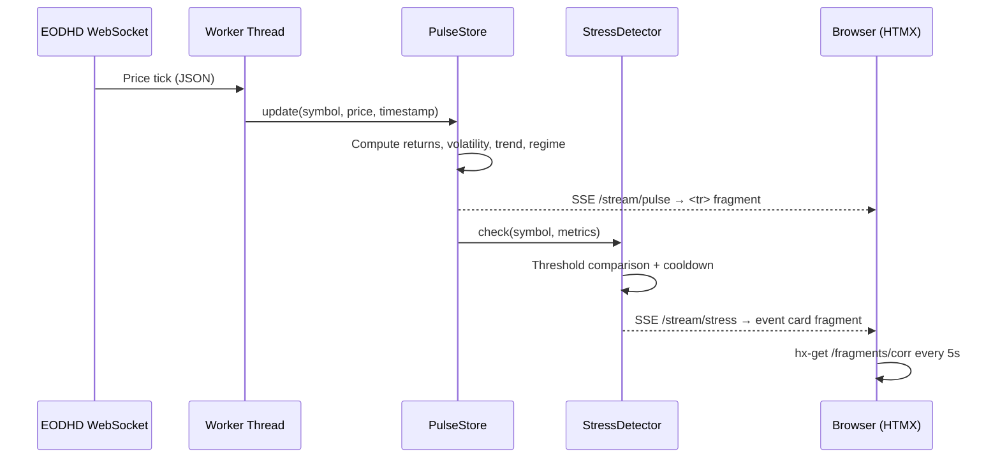

# Pulse — Real-Time Market Dashboard

[](https://github.com/Moonchichiii/pulse/actions/workflows/ci.yml)
[](https://www.python.org/downloads/release/python-3120/)
[](LICENSE)

A real-time multi-asset market dashboard that streams live prices from EODHD
WebSocket feeds (stocks, forex, crypto), computes rolling metrics, and
surfaces them through a server-rendered UI.

**The thesis:** You don't need a JavaScript SPA framework to build a real-time
dashboard. The server owns all state and computation. The browser receives
ready-to-render HTML fragments.

## Architecture



## Data Flow



## Tech Stack

| Layer | Tool | Why |
|-------|------|-----|
| Runtime | Python 3.12 | All financial logic lives here |
| Package manager | uv | Deterministic lockfile, sub-second installs |
| API framework | FastAPI | Async-native, WebSocket ingestion + SSE |
| Real-time UI | SSE via sse-starlette | Server pushes HTML fragments |
| Templating | Jinja2 | Server-side rendering of all UI |
| Client interactivity | HTMX (14 KB) | `hx-get`, `sse-swap`, zero JS build step |
| Optional client state | Alpine.js (15 KB) | Dropdowns/tabs only |
| Styling | Tailwind CSS | Utility-first, CDN for dev |
| Testing | pytest + pytest-asyncio + httpx | Async test client |
| Linting | ruff + mypy (strict) | Type safety enforced in CI |
| CI/CD | GitHub Actions | lint → test → Docker build + smoke |
| Containerization | Docker + docker-compose | Single command to run |
| Data source | EODHD WebSocket feeds | Stocks, forex, crypto |
| Deployment | Render | Docker-native, auto-deploy from main |

## Metrics Computed

| Metric | Window | Method |
|--------|--------|--------|
| Return (1m, 5m, 15m) | Rolling | `(latest - past) / past` |
| Volatility (15m) | Rolling | Tick-return standard deviation |
| Trend (15m) | Rolling | Log-price linear regression slope |
| Regime | Adaptive | `high_vol` if vol > 80th percentile of history |
| Correlation | Regime-aware | Pearson on time-bucketed aligned returns |

## Stress Events

| Event Type | Trigger | Cooldown |
|------------|---------|----------|
| `move_1m` | 1m return exceeds asset-class threshold | 30s per (symbol, type) |
| `move_5m` | 5m return exceeds asset-class threshold | 30s per (symbol, type) |
| `vol_spike` | Volatility exceeds regime threshold | 30s per (symbol, type) |

Asset-class thresholds: crypto > stocks > forex (reflecting typical volatility).

## Prerequisites

- [Python 3.12+](https://www.python.org/downloads/)
- [uv](https://docs.astral.sh/uv/) (package manager)
- [Docker](https://www.docker.com/) (optional, for container builds)
- An [EODHD API key](https://eodhd.com/) (for live data)

## Quick Start

### Local development

```bash
git clone https://github.com/Moonchichiii/pulse.git
cd pulse
uv sync --dev
uv run pre-commit install
```

Create a `.env` file:

```text
EODHD_API_KEY=your_key_here
```

Run the app:

```bash
uv run uvicorn pulse.main:app --reload --port 8000
```

Open [http://localhost:8000](http://localhost:8000).

### Docker

```bash
docker compose up --build
```

### Run checks

```bash
uv run ruff check src/ tests/
uv run ruff format --check src/ tests/
uv run mypy src/
uv run pytest -v --tb=short
```

Or use the Makefile:

```bash
make lint
make test
```

## Project Structure

```text
src/pulse/
├── main.py           FastAPI app, health endpoint, SSE routes
├── config.py         Pydantic settings (env vars)
├── feeds.py          EODHD WebSocket consumers
├── store.py          PulseStore — rolling buffers + metrics
├── events.py         StressDetector + EventStore
├── correlation.py    Time-bucketed correlation engine
├── worker.py         Background thread orchestration
└── templates/        Jinja2 templates (base, index, fragments)

tests/                pytest test suite
docs/adr/             Architecture Decision Records
```

## Architecture Decision Records

- [ADR-001: Streaming Architecture](docs/adr/001-streaming-architecture.md) —
  SSE to browser, WebSocket for ingestion only
- [ADR-002: HTMX over SPA](docs/adr/002-htmx-over-spa.md) — Server-side
  rendering with Jinja2, no JS build step

## Roadmap

- [x] **v0.1** — Skeleton & CI/CD (repo structure, CI pipeline, Docker)
- [ ] **v0.2** — Streaming + State (WebSocket consumers, PulseStore, metrics)
- [ ] **v0.3** — Events + Regime (StressDetector, regime tagging)
- [ ] **v0.4** — Correlation (bucketed alignment, Pearson, regime-aware)
- [ ] **v1.0** — Dashboard (Jinja2 templates, SSE endpoints, Tailwind UI)

## Contributing

See [CONTRIBUTING.md](CONTRIBUTING.md) for setup instructions and workflow.

## License

[MIT](LICENSE)
